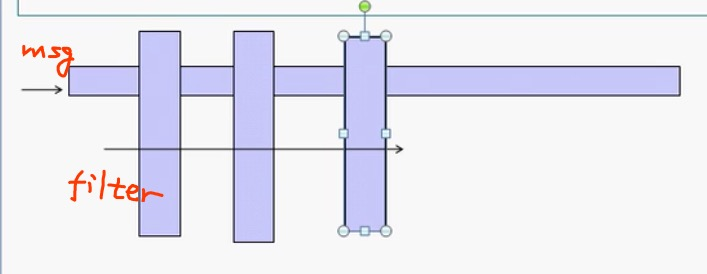
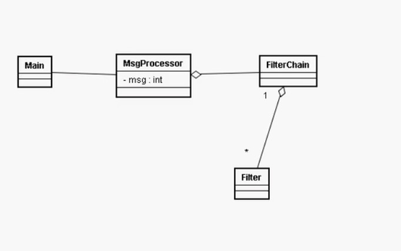
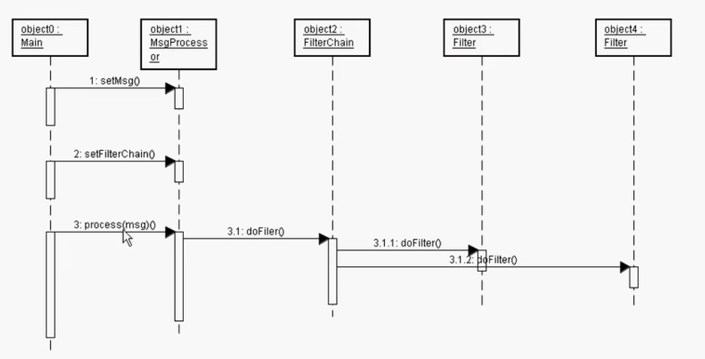

### 责任链
根据该例子可以看出：
    输入的消息在输出的过程中，通过了一系列处理之后，得到最终的结果。
    而这一些列的结果就是不同的过滤过程，构成了一个链式的过滤
    
    
   
   
   
   继续修改，对于filter chain，使用链条式的编程
   
   利用FilterChain类，将所有的Filter集中起来
   而在Main方法中按照自己想要的顺序将Filter加入其中，对信息进行处理，
   将责任分发给各个类
   
   
   
   
   
   